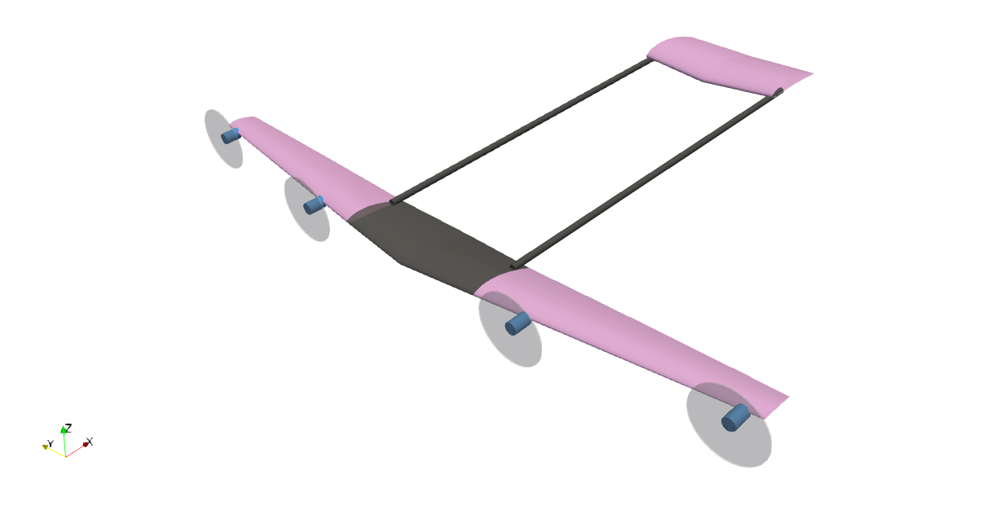
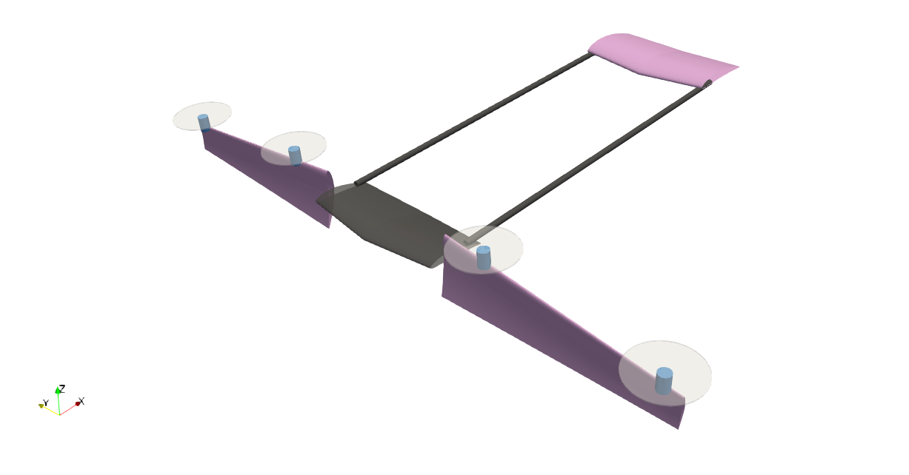
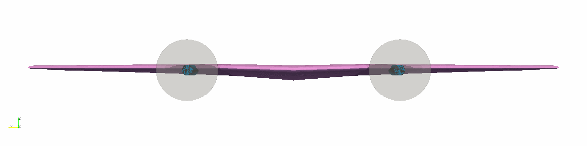

# AircraftDesignTools
Tools for sizing, layout, mission analysis, and optimization of aircraft design. Written for Julia 0.6.4.




# Dependencies
  * GeometricTools: `https://github.com/byuflowlab/GeometricTools.jl`

# Installation
```julia
Pkg.clone("git@github.com:EdoAlvarezR/AircraftDesignTools.jl.git")
```

# Authorship
  * Author    : Eduardo J. Alvarez
  * Email     : Edo.AlvarezR@gmail.com
  * Created   : July 2019
  * License   : AGPL-3.0


  
